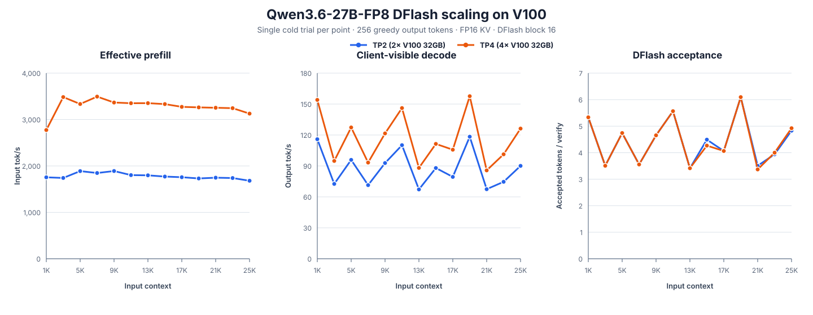
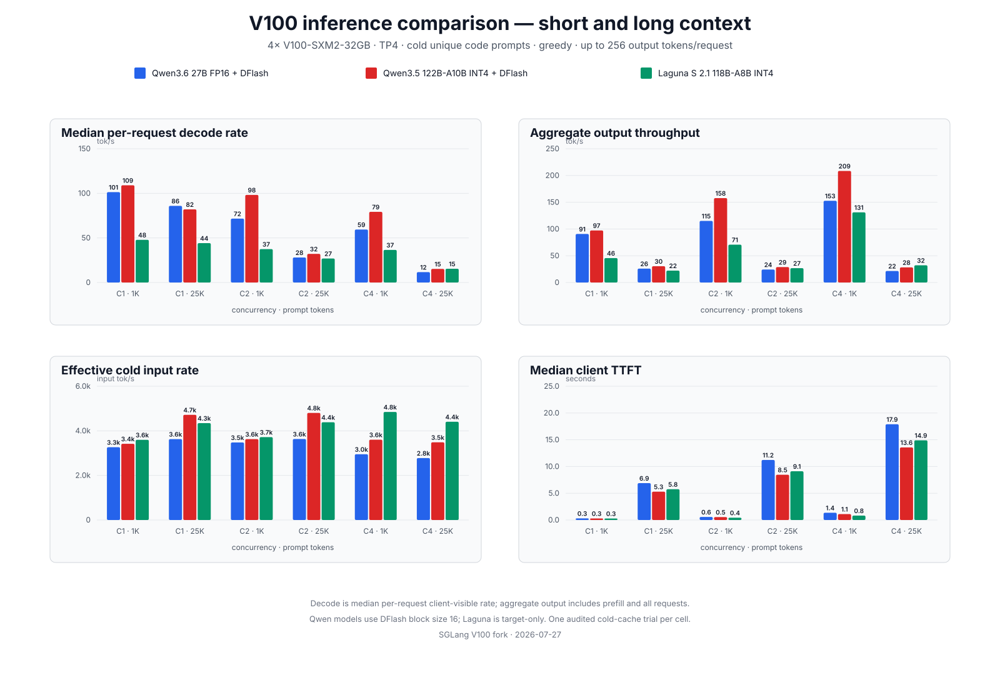
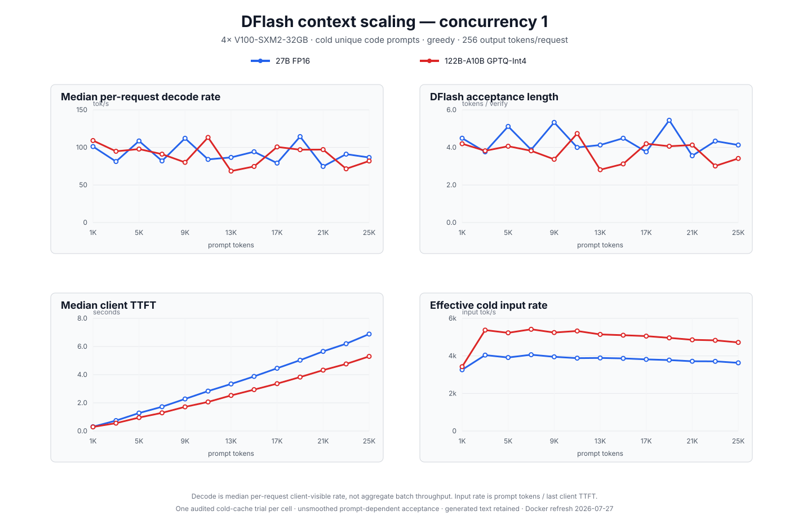
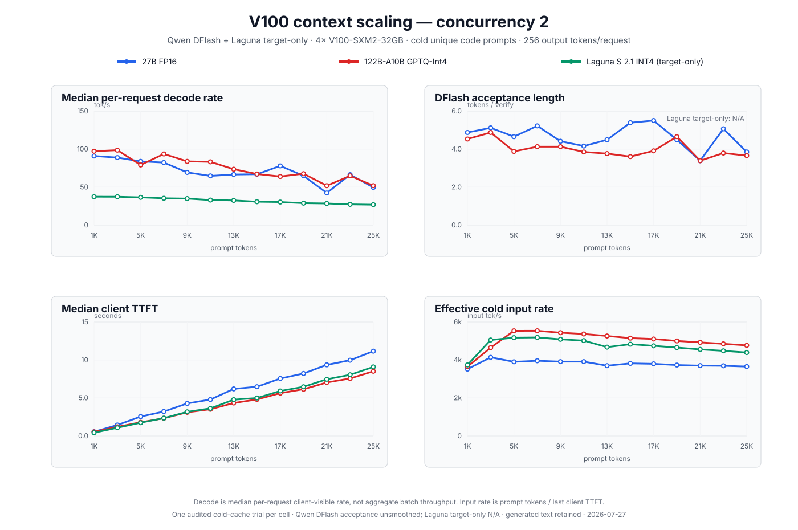
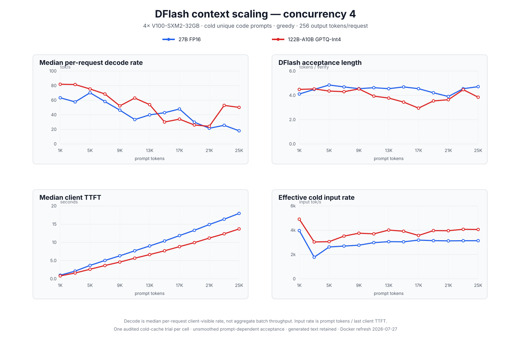

# SGLang for 4× NVIDIA V100 32 GB NVLink

This fork adapts SGLang for four SM70 V100 GPUs. It includes a TileLang
FlashAttention backend, V100-aware paged KV-cache and decode tuning, custom
all-reduce support, TurboMind FP16 MoE kernels, and Marlin
GPTQ/AWQ/compressed-tensors MoE kernels.

The commands below target x86-64 Ubuntu, four 32 GB V100s connected by NVLink,
and a sufficiently recent NVIDIA driver. They intentionally create a dedicated
Conda environment named `sglang-v100`.

## Copy, paste, and build

Paste this block into a terminal. It is safe to rerun: the checkout, dependency
sources, build products, and Conda environment are reused.

```bash
if [[ -d "$HOME/sglang-V100/.git" ]]; then
  git -C "$HOME/sglang-V100" pull --ff-only
else
  git clone https://github.com/haohervchb/sglang-V100.git "$HOME/sglang-V100"
fi
bash "$HOME/sglang-V100/scripts/install_v100.sh"
```

Run the installer with `bash`; do not source it. Its strict error handling then
lives in a child process, so a failed command reports its line and returns to
the SSH prompt instead of exiting the login shell. Compilation uses all CPU
threads that available RAM can safely sustain, rather than a hard-coded job
count. Set `MAX_JOBS=16` before the command only if you want to impose a limit.

The installer builds only SM70 `sglang-kernel` targets, applies the exact
FlashInfer SM70, 1Cat V100 attention, and Marlin SM70 compatibility patches
kept in this repository, builds the unified TurboMind W8A16 block-FP8 and FP16
MoE extension, verifies NCCL, and precompiles FlashInfer's sampling module. The
last step moves its roughly minute-long cold JIT cost from the first chat into
installation/startup.

If only the final validation step fails, do not rerun the installer or rebuild
anything. After pulling the latest changes, rerun validation directly:

```bash
bash "$HOME/sglang-V100/scripts/smoke_v100.sh"
```

The installer removes the separately distributed FlashInfer cubin package and
uses the pinned SM70 source build for both Python and native code. No
FlashInfer version-check override is required.

### Updating an existing host installation

If `scripts/install_v100.sh` has already completed successfully for this
checkout, normal Python/model changes do not require rebuilding FlashInfer,
`sglang-kernel`, native V100 attention, or Marlin. The SGLang package is
installed editable, so update the checkout and keep using the existing
`sglang-v100` environment:

```bash
git -C "$HOME/sglang-V100" pull --ff-only
conda activate sglang-v100
bash "$HOME/sglang-V100/scripts/smoke_v100.sh"
```

The Qwen3.6-35B-A3B FP16 MoE path adds native code to the unified TurboMind
extension. Hosts installed before this support landed must rebuild that
extension once after pulling, then validate it:

```bash
conda activate sglang-v100
python -m pip install cuda-tile==1.5.0
MAX_JOBS=4 python "$HOME/sglang-V100/scripts/build_sm70_turbomind.py"
bash "$HOME/sglang-V100/scripts/smoke_v100.sh"
```

The pinned CUDA Tile package satisfies the communication-module import used by
the bundled FlashInfer source. The build reuses the installer-managed
`~/1Cat-vLLM` and CUTLASS source trees; it does not rebuild FlashInfer, native
attention, Marlin, or `sglang-kernel`.

The Laguna SM70 Marlin selector added on 2026-07-28 is a native-kernel change.
After pulling it onto a host built from an older revision, rebuild only Marlin
once, then validate:

```bash
conda activate sglang-v100
bash "$HOME/sglang-V100/scripts/setup_v100_marlin.sh"
bash "$HOME/sglang-V100/scripts/smoke_v100.sh"
```

Rerun `scripts/install_v100.sh` only when the installer, dependency pins,
patches, `sgl-kernel`, or Python dependency metadata change. A normal pull of
the Laguna or Qwen DFlash Python/model code is not a native rebuild trigger.
The grouped DFlash target verifier is shipped as Python source and compiled by
TileLang on first use, so an existing editable host install only needs the pull
and smoke-test sequence above.

When an installer-managed dependency patch changes, the installer preserves
the prior patched source beside the replacement as
`<dependency>.sglang-v100-backup-<fingerprint>`. Remove that backup only after
the rebuilt environment passes `scripts/smoke_v100.sh`.

## Docker: pull and run

The Docker image mirrors the host build: CUDA 12.8, Torch 2.9.1, the patched
FlashInfer SM70 source, direct-E4M3 V100 XQA, TurboMind W8A16 block-FP8 and
FP16 MoE, SM70-only `sglang-kernel`, V100 Marlin, and NCCL 2.27.5. It contains
the complete serving runtime; no repository checkout or host Python
environment is mounted into the container. Pull the published image with:

```bash
docker pull geesegeesegeese/sglang-v100:latest
```

The published image and its tags are also available on Docker Hub at
<https://hub.docker.com/r/geesegeesegeese/sglang-v100>, so it can be browsed or
pulled without a local build.

Published images can lag the source branch. Build `sglang-v100:latest` locally
with the command below when testing an unpublished change. A normal Laguna or
Qwen DFlash Python-only update reuses every native layer and rebuilds only the
application and validation layers. A change to the Laguna-specific Marlin
patch rebuilds Marlin and those later layers, while retaining the cached
FlashInfer, native-attention, and `sglang-kernel` layers. A change to the
TurboMind bindings or FP16 MoE source rebuilds only that private extension and
the later application layers.

Model checkpoints are not embedded in the image. The command below bind-mounts
the host Hugging Face cache, so it reuses checkpoints already downloaded by a
host install and keeps any new downloads in `$HOME/.cache/huggingface`. This is
intentional: the 122B target is about 75 GB, and hiding another copy inside an
empty Docker volume can fill the host filesystem. A separate, much smaller
`sglang-v100-jit` Docker volume retains FlashInfer, TileLang, Triton, and
TorchInductor JIT output.

Serve Qwen3.5-122B-A10B GPTQ-Int4 with DFlash on four V100s:

```bash
mkdir -p "$HOME/.cache/huggingface"

docker run --rm --gpus all --network host --ipc host \
  --ulimit memlock=-1 --ulimit stack=67108864 \
  -v "$HOME/.cache/huggingface:/root/.cache/huggingface" \
  -v sglang-v100-jit:/root/sglang-v100-jit \
  -e SGLANG_ENABLE_SPEC_V2=1 \
  -e SGLANG_ENABLE_OVERLAP_PLAN_STREAM=1 \
  geesegeesegeese/sglang-v100:latest \
  --model Qwen/Qwen3.5-122B-A10B-GPTQ-Int4 \
  --dtype float16 \
  --quantization gptq_marlin \
  --attention-backend flash_attn_v100 \
  --tensor-parallel-size 4 \
  --host 0.0.0.0 \
  --port 8082 \
  --mem-fraction-static 0.76 \
  --context-length 262144 \
  --max-running-requests 4 \
  --chunked-prefill-size 4096 \
  --mamba-scheduler-strategy extra_buffer \
  --cuda-graph-max-bs 4 \
  --cuda-graph-bs 1 2 4 \
  --enable-nccl-nvls \
  --speculative-algorithm DFLASH \
  --speculative-draft-model-path z-lab/Qwen3.5-122B-A10B-DFlash \
  --speculative-dflash-block-size 16 \
  --reasoning-parser qwen3 \
  --tool-call-parser qwen3_coder
```

The explicit CUDA-graph limit is important on 32 GB V100s. Without it,
SGLang's general low-memory TP4 heuristic can select a maximum graph batch of
80 even when `--max-running-requests 4` is set, consuming the headroom needed
by first-request JIT kernels. The published command uses 0.76 for a cold cache.
After the JIT volume is warm and measured headroom permits it, 0.78 provides
more KV capacity. Before the first download, make sure the filesystem containing
`$HOME/.cache/huggingface` has at least 80 GB free for the target and draft
checkpoints. Do not replace the Hugging Face bind mount with a new named volume
unless a separate, private copy of every model is genuinely wanted.

Earlier README versions mounted `sglang-v100-cache` over all of `/root/.cache`.
That volume starts empty even when the host Hugging Face cache is populated, so
Docker downloads the models again. After stopping containers that use it, an
unneeded old cache can be inspected and then removed with:

```bash
docker run --rm -v sglang-v100-cache:/cache alpine du -sh /cache
docker volume rm sglang-v100-cache
```

The removal command permanently deletes everything stored in that old volume;
run it only after confirming that it contains no checkpoint copy you need. A
warning that a z-lab DFlash draft repository has no `generation_config.json` is
expected: generation settings come from the target model.

For a local image build, BuildKit keeps every expensive native component in
its own layer, so rerunning this exact command resumes from the last completed
component:

```bash
cd "$HOME/sglang-V100"
DOCKER_BUILDKIT=1 docker build --network=host \
  -f docker/v100.Dockerfile \
  -t sglang-v100:latest .
```

Build parallelism is selected from the CPUs and available memory visible to
Docker. To impose a manual limit, add `--build-arg MAX_JOBS=16`. Replace the
published image name in the serving command with `sglang-v100:latest` to use
the local build. No Laguna-, Qwen-, or DFlash-specific build argument is
required; TileLang kernels are JIT-compiled into the persistent cache volume
on first use.

The container validates the GPU stack, verifies the real SM70 Marlin repack,
and warms the FlashInfer sampler before starting SGLang. If the Docker Compose
v2 plugin is installed, it can build the same local image with:

```bash
docker compose -f docker/v100-compose.yaml build
```

`docker compose -f docker/v100-compose.yaml up --build` additionally starts
the Qwen3.5 DFlash command stored in the Compose file; it does not select
Laguna. Use the explicit Laguna `docker run` command below after building.

## Serve models

Run `conda activate sglang-v100` first. The LLM examples listen on port 8082;
MiniMax-H3 below uses port 30010. Stop one server before starting another.

### MiniMax-H3 video and audio on four V100s

MiniMax-H3 uses SGLang's diffusion server and the asynchronous OpenAI-compatible
video API. This fork runs the DiT and Qwen3-VL text encoder with TP4, uses FP16
for Volta, selects portable Torch SDPA attention, and can store each rank's
linear-weight shards as per-channel INT8:

```bash
NCCL_P2P_LEVEL=NVL \
sglang serve \
  --model-path MiniMaxAI/MiniMax-H3 \
  --model-variant fl2va \
  --num-gpus 4 \
  --tp-size 4 \
  --sp-degree 1 \
  --ulysses-degree 1 \
  --ring-degree 1 \
  --performance-mode speed \
  --quantization v100_w8a16 \
  --attention-backend torch_sdpa \
  --dit-cpu-offload \
  --text-encoder-cpu-offload \
  --vae-cpu-offload \
  --enable-torch-compile false \
  --host 0.0.0.0 \
  --port 30010
```

`v100_w8a16` is an online storage format, not a native INT8 GEMM. Checkpoint
weights load and TP-shard in FP16, then each rank stores its local linear
matrices in INT8 with FP16 row scales. A layer is dequantized to FP16 only for
its GEMM so cuBLAS can use V100 Tensor Cores. Large linear weights therefore
use approximately half their FP16 steady-state VRAM, while non-linear weights,
activations, VAE state, and temporary dequantization buffers do not receive a
2× reduction. The three offload flags are the conservative starting point for
4x32-GiB V100 hosts: only the component active in the current pipeline phase is
resident on each GPU. Remove them one at a time only after measuring headroom.

Each released checkpoint partition is about 134 GiB on disk. Selecting
`--model-variant fl2va` downloads/loads `FL2VA` only; it does not also fetch the
separate `Ref2VA` partition. Budget disk space separately from the lower online
W8A16 runtime footprint.

The `fl2va` partition serves both text-to-video-and-audio (`t2va`) and
first/last-frame conditioning (`fl2va`). Submit a text-only job, poll it, and
download the synchronized MP4 with:

```bash
video_id=$(
  curl -sS -X POST http://127.0.0.1:30010/v1/videos \
    -H 'Content-Type: application/json' \
    -d '{
      "model": "MiniMaxAI/MiniMax-H3",
      "prompt": "A tiger walks slowly through morning fog while birds and leaves are heard around it.",
      "task": "t2va",
      "conditions": [],
      "target": {
        "short_edge": 768,
        "aspect_ratio": "16:9",
        "duration_seconds": 5.0
      },
      "num_inference_steps": 50,
      "flow_shift": 12.0,
      "audio_flow_shift": 3.0,
      "seed": 1101
    }' | jq -r '.id'
)

while true; do
  status=$(curl -sS "http://127.0.0.1:30010/v1/videos/$video_id" | jq -r '.status')
  [ "$status" = completed ] && break
  [ "$status" = failed ] && exit 1
  sleep 1
done

curl -sS -L "http://127.0.0.1:30010/v1/videos/$video_id/content" \
  -o minimax-h3-t2va.mp4
```

For the ComfyUI equivalent of first-frame or first-and-last-frame workflows,
keep the same server and change the request to `task: "fl2va"`. Put the input
files somewhere visible to every server rank and pass them as conditions:

```json
{
  "prompt": "Continue this scene with calm natural motion and synchronized ambient sound.",
  "task": "fl2va",
  "conditions": [
    {
      "type": "image",
      "uri": "file:///data/minimax-h3/first-frame.png",
      "role": "keyframe",
      "frame_index": 0
    }
  ],
  "target": {
    "short_edge": 768,
    "aspect_ratio": "auto",
    "duration_seconds": 5.0
  },
  "num_inference_steps": 50,
  "flow_shift": 12.0,
  "audio_flow_shift": 3.0,
  "seed": 2101
}
```

Use `frame_index: -1` for a last frame or include both `0` and `-1`. Reference
image/audio/video and video-to-video workflows require a second server launched
with `--model-variant ref2va`; they use `task: "ref2va"` and reference-role
conditions. The two variants are different released checkpoint partitions and
cannot be switched per request without restarting or running a second server.

### Qwen3.5-122B-A10B GPTQ Int4

```bash
NCCL_P2P_LEVEL=NVL \
SGLANG_CUSTOM_ALLREDUCE_ALGO=1stage \
SGLANG_MAMBA_CONV_DTYPE=float16 \
SGLANG_MAMBA_SSM_DTYPE=float16 \
sglang serve \
  --model Qwen/Qwen3.5-122B-A10B-GPTQ-Int4 \
  --dtype float16 \
  --quantization gptq_marlin \
  --attention-backend flash_attn_v100 \
  --tensor-parallel-size 4 \
  --host 0.0.0.0 \
  --port 8082 \
  --mem-fraction-static 0.78 \
  --context-length 262144 \
  --max-running-requests 4 \
  --chunked-prefill-size 16384 \
  --enable-nccl-nvls
```

### Qwen3.5-122B-A10B AWQ

```bash
NCCL_P2P_LEVEL=NVL \
SGLANG_CUSTOM_ALLREDUCE_ALGO=1stage \
SGLANG_MAMBA_CONV_DTYPE=float16 \
SGLANG_MAMBA_SSM_DTYPE=float16 \
sglang serve \
  --model QuantTrio/Qwen3.5-122B-A10B-AWQ \
  --dtype float16 \
  --quantization awq_marlin \
  --attention-backend flash_attn_v100 \
  --tensor-parallel-size 4 \
  --host 0.0.0.0 \
  --port 8082 \
  --mem-fraction-static 0.78 \
  --context-length 262144 \
  --max-running-requests 4 \
  --chunked-prefill-size 16384 \
  --enable-nccl-nvls
```

### Qwen3.6-35B-A3B unquantized FP16

This is the full-size official `Qwen/Qwen3.6-35B-A3B` checkpoint, not the AWQ
conversion below. It uses the native SM70 FP16 routed-MoE path. Leave the
custom all-reduce algorithm unset: the size-aware policy keeps one-shot
reductions for decode and selects two-shot reductions for large prefills.

```bash
NCCL_P2P_LEVEL=NVL \
SGLANG_MAMBA_CONV_DTYPE=float16 \
SGLANG_MAMBA_SSM_DTYPE=float16 \
SGLANG_ENABLE_OVERLAP_PLAN_STREAM=1 \
sglang serve \
  --model Qwen/Qwen3.6-35B-A3B \
  --dtype float16 \
  --attention-backend flash_attn_v100 \
  --tensor-parallel-size 4 \
  --host 0.0.0.0 \
  --port 8082 \
  --mem-fraction-static 0.70 \
  --context-length 262144 \
  --max-running-requests 4 \
  --chunked-prefill-size 8192 \
  --mamba-scheduler-strategy extra_buffer \
  --cuda-graph-max-bs 4 \
  --cuda-graph-bs 1 2 4 \
  --enable-nccl-nvls \
  --enable-multimodal \
  --reasoning-parser qwen3 \
  --tool-call-parser qwen3_coder
```

The FP16 MoE path is enabled automatically when its native extension is
present. Set `SGLANG_SM70_FP16_MOE=0` only for a diagnostic comparison with
the generic Triton MoE runner.

### Qwen3.6-35B-A3B AWQ

```bash
NCCL_P2P_LEVEL=NVL \
SGLANG_CUSTOM_ALLREDUCE_ALGO=1stage \
SGLANG_MAMBA_CONV_DTYPE=float16 \
SGLANG_MAMBA_SSM_DTYPE=float16 \
sglang serve \
  --model QuantTrio/Qwen3.6-35B-A3B-AWQ \
  --dtype float16 \
  --quantization awq_marlin \
  --attention-backend flash_attn_v100 \
  --tensor-parallel-size 4 \
  --host 0.0.0.0 \
  --port 8082 \
  --mem-fraction-static 0.78 \
  --context-length 262144 \
  --max-running-requests 4 \
  --chunked-prefill-size 16384
```

### Qwen3.6-27B dense FP16

```bash
NCCL_P2P_LEVEL=NVL \
SGLANG_CUSTOM_ALLREDUCE_ALGO=1stage \
SGLANG_MAMBA_CONV_DTYPE=float16 \
SGLANG_MAMBA_SSM_DTYPE=float16 \
sglang serve \
  --model Qwen/Qwen3.6-27B \
  --dtype float16 \
  --attention-backend flash_attn_v100 \
  --tensor-parallel-size 4 \
  --host 0.0.0.0 \
  --port 8082 \
  --mem-fraction-static 0.80 \
  --context-length 262144 \
  --max-running-requests 4 \
  --chunked-prefill-size 16384 \
  --enable-nccl-nvls
```

### Qwen3.6-27B block-FP8 on V100

V100 has no native FP8 tensor-core arithmetic, so this fork serves the factory
`Qwen/Qwen3.6-27B-FP8` checkpoint as W8A16. TurboMind handles small-M decode
GEMMs directly from block-FP8 weights; large prefill projections temporarily
materialize one FP16 weight at a time and use cuBLAS. This avoids retaining a
full FP16 model while keeping prefill close to the unquantized checkpoint.

The following target-only command uses the compact E4M3 KV cache. It is the
recommended starting point for long-context, single-request serving on four
32 GB V100s:

```bash
NCCL_P2P_LEVEL=NVL \
SGLANG_CUSTOM_ALLREDUCE_ALGO=1stage \
SGLANG_MAMBA_CONV_DTYPE=float16 \
SGLANG_MAMBA_SSM_DTYPE=float16 \
sglang serve \
  --model Qwen/Qwen3.6-27B-FP8 \
  --dtype float16 \
  --kv-cache-dtype fp8_e4m3 \
  --attention-backend flash_attn_v100 \
  --tensor-parallel-size 4 \
  --host 0.0.0.0 \
  --port 8082 \
  --mem-fraction-static 0.80 \
  --context-length 262144 \
  --max-running-requests 1 \
  --chunked-prefill-size 4096 \
  --mamba-full-memory-ratio 0.1 \
  --mamba-scheduler-strategy extra_buffer \
  --cuda-graph-max-bs 1 \
  --cuda-graph-bs 1 \
  --enable-nccl-nvls \
  --reasoning-parser qwen3 \
  --tool-call-parser qwen3_coder
```

Use `--kv-cache-dtype auto` for an FP16 KV cache. FP16 KV is a little faster
for decode, while E4M3 provides approximately twice the KV-token capacity.
The SM70 E4M3 path uses direct XQA for decode and dequantizes each active
prefix page once into reusable FP16 scratch for prefill. It does not repeatedly
decode the same cache bytes for each GQA query head.

## Decode acceleration with MTP or DFlash

MTP and DFlash are alternative speculative decoders; enable one at a time.
The supported Qwen target checkpoints include a built-in MTP layer. To enable
it, add these arguments to the corresponding non-DFlash serving command:

```bash
  --speculative-algorithm EAGLE \
  --speculative-num-steps 3 \
  --speculative-eagle-topk 1 \
  --speculative-num-draft-tokens 4 \
  --mamba-scheduler-strategy extra_buffer
```

Do not set `--speculative-draft-model-path` for MTP. SGLang selects the MTP
layer from the target checkpoint, including the unquantized MTP weights stored
inside the factory GPTQ-Int4 checkpoint.

To pair the factory Qwen3.5-122B-A10B GPTQ-Int4 target with its DFlash draft,
add:

```bash
  --speculative-algorithm DFLASH \
  --speculative-draft-model-path z-lab/Qwen3.5-122B-A10B-DFlash \
  --speculative-dflash-block-size 16 \
  --mamba-scheduler-strategy extra_buffer
```

To pair the dense Qwen3.6-27B target with its DFlash draft, add:

```bash
  --speculative-algorithm DFLASH \
  --speculative-draft-model-path z-lab/Qwen3.6-27B-DFlash \
  --speculative-dflash-block-size 16 \
  --mamba-scheduler-strategy extra_buffer
```

To pair either the unquantized or AWQ Qwen3.6-35B-A3B target with its DFlash
draft, add:

```bash
  --speculative-algorithm DFLASH \
  --speculative-draft-model-path z-lab/Qwen3.6-35B-A3B-DFlash \
  --speculative-dflash-block-size 16 \
  --mamba-scheduler-strategy extra_buffer
```

On V100, DFlash draft attention and linear target verification automatically
use the native SM70 paged-attention kernel. The kernel applies each draft
layer's causal sliding window or bidirectional full-attention semantics. MTP
draft extension uses Triton, while its linear target verification uses the
native SM70 kernel.
Top-k-1 MTP target verification uses the native TileLang paged-prefill kernel;
tree verification continues to use Triton's custom-mask path. Ordinary target
prefill remains on `flash_attn_v100`. Block size 16 is the low-concurrency
starting point for all three drafts. For 35B-A3B with four simultaneously
active requests, also compare block size 8; the smaller verifier batch can
improve latency and graph-memory use. Compare acceptance rate and inter-token
latency on the actual workload.

For full-attention 16-token verification blocks, the long-context SM70 path
partitions KV work across up to 80 V100 SMs and processes GQA heads in groups of
up to four. This replaces the ordinary extend kernel's serial full-prefix scan
and avoids reloading the same K/V data once per query head.

The long-context kernel improvement is best measured independently of draft
acceptance. The following is the raw time for one full-attention target verify
layer with a 16-token block on one V100 (TP4 per-rank head shapes):

| Target shape | Context | Old serial scan | Split-KV verify |
| --- | ---: | ---: | ---: |
| Qwen3.6-27B | 100,000 | 18.83 ms | 1.04 ms |
| Qwen3.6-27B | 150,000 | 27.58 ms | 1.54 ms |
| Qwen3.5-122B-A10B | 100,000 | 19.17 ms | 1.04 ms |
| Qwen3.5-122B-A10B | 150,000 | 27.34 ms | 1.53 ms |

Do not use repeated-token prompts to estimate application throughput. They can
produce unusually high DFlash acceptance and make end-to-end numbers too
optimistic. The audited cold-prompt benchmark below records acceptance beside
decode speed and retains generated text so corrupt output cannot masquerade as
performance.

The serving implementation uses the cumulative mainline spec-v2 relay and
scheduling architecture by default while retaining the native SM70 draft and
verification kernels. Set `SGLANG_ENABLE_SPEC_V2=0` only to diagnose the legacy
v1 worker. The complete known-good v1 source is tagged
`dev-dflash-v1-sm70-baseline-20260716`.

### Validated MTP serving commands

The following MTP commands were validated on four V100-SXM2-32GB GPUs. Each
command includes its runtime environment variables inline and listens on port
8082.

Qwen3.5-122B-A10B GPTQ-Int4 with its built-in MTP layer:

```bash
NCCL_P2P_LEVEL=NVL \
SGLANG_CUSTOM_ALLREDUCE_ALGO=1stage \
SGLANG_MAMBA_CONV_DTYPE=float16 \
SGLANG_MAMBA_SSM_DTYPE=float16 \
SGLANG_ENABLE_SPEC_V2=1 \
sglang serve \
  --model Qwen/Qwen3.5-122B-A10B-GPTQ-Int4 \
  --dtype float16 \
  --quantization gptq_marlin \
  --attention-backend flash_attn_v100 \
  --tensor-parallel-size 4 \
  --host 0.0.0.0 \
  --port 8082 \
  --mem-fraction-static 0.70 \
  --context-length 8192 \
  --max-running-requests 4 \
  --chunked-prefill-size 4096 \
  --mamba-scheduler-strategy extra_buffer \
  --cuda-graph-max-bs 4 \
  --cuda-graph-bs 1 2 4 \
  --enable-nccl-nvls \
  --speculative-algorithm EAGLE \
  --speculative-num-steps 3 \
  --speculative-eagle-topk 1 \
  --speculative-num-draft-tokens 4
```

Qwen3.6-27B dense FP16 with its built-in MTP layer:

```bash
NCCL_P2P_LEVEL=NVL \
SGLANG_CUSTOM_ALLREDUCE_ALGO=1stage \
SGLANG_MAMBA_CONV_DTYPE=float16 \
SGLANG_MAMBA_SSM_DTYPE=float16 \
SGLANG_ENABLE_SPEC_V2=1 \
sglang serve \
  --model Qwen/Qwen3.6-27B \
  --dtype float16 \
  --attention-backend flash_attn_v100 \
  --tensor-parallel-size 4 \
  --host 0.0.0.0 \
  --port 8082 \
  --mem-fraction-static 0.70 \
  --context-length 8192 \
  --max-running-requests 4 \
  --chunked-prefill-size 4096 \
  --mamba-scheduler-strategy extra_buffer \
  --cuda-graph-max-bs 4 \
  --cuda-graph-bs 1 2 4 \
  --enable-nccl-nvls \
  --speculative-algorithm EAGLE \
  --speculative-num-steps 3 \
  --speculative-eagle-topk 1 \
  --speculative-num-draft-tokens 4
```

For MTP, do not set `--speculative-draft-model-path`; SGLang loads the built-in
MTP layer from the target checkpoint.

## DFlash support

DFlash spec-v2 itself is implemented entirely in the Python runtime plus Triton
JIT kernels. It adds no package, compiler, patch, or native-extension
requirement. On a local editable install, pulling DFlash-only changes exposes
the new modules immediately. In Docker, those source changes invalidate only
the late `COPY python` application layer. The Laguna SM70 Marlin geometry
selector documented below is a separate native optimization and requires the
one-time Marlin rebuild described above. The first DFlash launch may populate
the existing Triton and TorchInductor caches.

Run `conda activate sglang-v100` before using these commands. They are
model-specific configurations tested on this machine. The conservative
Laguna target-only example uses two live requests; the audited DFlash and Qwen
examples use four.
Hybrid DFlash target verification requires an exact CUDA graph for every live
batch size. The runtime therefore expands `--cuda-graph-bs 1 2 4` to target
graphs 1, 2, 3, and 4; the added batch-three graph used about 20–30 MiB per GPU
in these runs.

The commands below keep recurrent SSM state in FP16 to fit the tested
four-request configurations. DFlash verification now preserves the same
per-token FP16 store/load boundary as ordinary decode, so enabling DFlash does
not introduce a separate recurrent-state trajectory. For maximum model fidelity,
especially on visual inputs, use `SGLANG_MAMBA_SSM_DTYPE=float32` (the Qwen
checkpoint setting) and remeasure memory headroom; the FP16 override still
reduces the target model's recurrent-state precision in both speculative and
ordinary decode.

DFlash currently supports parsed, unconstrained tool calls (`tool_choice="auto"`).
Grammar-constrained requests (`tool_choice="required"` or a named tool choice)
are rejected with HTTP 400; use `auto` or serve without DFlash when the API must
enforce a tool choice.

### Poolside Laguna-S-2.1 INT4 and DFlash

The following target-only command is validated on four V100-SXM2-32GB GPUs.
The low SWA/full ratio is important: Laguna has many sliding-window layers, so
the generic `0.8` default wastes most of the KV budget on their 32K-token
window. This configuration allocated 399,184 full-attention token slots and
31,920 sliding-window token slots per rank: enough for one complete 262K
request, with 399K aggregate full-attention slots shared by up to two live
requests. The 128-way decode split improved 90K-context decode by about 7% over
this fork's automatic 64-way setting.

```bash
NCCL_P2P_LEVEL=NVL \
SGLANG_CUSTOM_ALLREDUCE_ALGO=1stage \
sglang serve \
  --model poolside/Laguna-S-2.1-INT4 \
  --trust-remote-code \
  --dtype float16 \
  --kv-cache-dtype auto \
  --attention-backend flash_attn_v100 \
  --moe-runner-backend marlin \
  --tensor-parallel-size 4 \
  --host 0.0.0.0 \
  --port 8082 \
  --mem-fraction-static 0.76 \
  --swa-full-tokens-ratio 0.08 \
  --context-length 262144 \
  --page-size 16 \
  --max-running-requests 2 \
  --chunked-prefill-size 4096 \
  --triton-attention-num-kv-splits 128 \
  --cuda-graph-max-bs 2 \
  --cuda-graph-bs 1 2 \
  --enable-nccl-nvls \
  --reasoning-parser poolside_v1 \
  --tool-call-parser poolside_v1
```

For a locally built container, the equivalent target-only command is:

```bash
mkdir -p "$HOME/.cache/huggingface"

docker run --rm --gpus all --network host --ipc host \
  --ulimit memlock=-1 --ulimit stack=67108864 \
  -v "$HOME/.cache/huggingface:/root/.cache/huggingface" \
  -v sglang-v100-jit:/root/sglang-v100-jit \
  sglang-v100:latest \
  --model poolside/Laguna-S-2.1-INT4 \
  --trust-remote-code \
  --dtype float16 \
  --kv-cache-dtype auto \
  --attention-backend flash_attn_v100 \
  --moe-runner-backend marlin \
  --tensor-parallel-size 4 \
  --host 0.0.0.0 \
  --port 8082 \
  --mem-fraction-static 0.76 \
  --swa-full-tokens-ratio 0.08 \
  --context-length 262144 \
  --page-size 16 \
  --max-running-requests 2 \
  --chunked-prefill-size 4096 \
  --triton-attention-num-kv-splits 128 \
  --cuda-graph-max-bs 2 \
  --cuda-graph-bs 1 2 \
  --enable-nccl-nvls \
  --reasoning-parser poolside_v1 \
  --tool-call-parser poolside_v1
```

Poolside replaced the incompatible drafter on 2026-07-28. The following exact
pair is validated on four V100-SXM2-32GB GPUs:

- target revision `67dbeda456e68139f281c40831f9d12049d8fc11`;
- draft revision `f6b32f4fb7ef2fb2ad481bb4c05433a2bf8b0ed1`.

The draft safetensors SHA-256 is
`c9665e30bbced996011d1a3f8dcc392af4ea5463fc8a469cdc7019f2795a24b5`.
Its six auxiliary target-layer norms, projection, attention gates, and
six-layer draft stack match the Laguna integration merged in
[SGLang #29446](https://github.com/sgl-project/sglang/pull/29446). A pinned,
reproducible DFlash command is:

```bash
NCCL_P2P_LEVEL=NVL \
SGLANG_CUSTOM_ALLREDUCE_ALGO=1stage \
SGLANG_ENABLE_SPEC_V2=1 \
SGLANG_ENABLE_OVERLAP_PLAN_STREAM=1 \
sglang serve \
  --model poolside/Laguna-S-2.1-INT4 \
  --revision 67dbeda456e68139f281c40831f9d12049d8fc11 \
  --trust-remote-code \
  --dtype float16 \
  --kv-cache-dtype auto \
  --attention-backend flash_attn_v100 \
  --moe-runner-backend marlin \
  --tensor-parallel-size 4 \
  --host 0.0.0.0 \
  --port 8082 \
  --mem-fraction-static 0.76 \
  --swa-full-tokens-ratio 0.08 \
  --context-length 262144 \
  --page-size 16 \
  --max-running-requests 4 \
  --chunked-prefill-size 4096 \
  --triton-attention-num-kv-splits 128 \
  --cuda-graph-max-bs 4 \
  --cuda-graph-bs 1 2 4 \
  --enable-nccl-nvls \
  --speculative-algorithm DFLASH \
  --speculative-draft-model-path poolside/Laguna-S-2.1-DFlash-INT4 \
  --speculative-draft-model-revision f6b32f4fb7ef2fb2ad481bb4c05433a2bf8b0ed1 \
  --speculative-dflash-block-size 8 \
  --reasoning-parser poolside_v1 \
  --tool-call-parser poolside_v1
```

SGLang's DFlash block size includes the already committed token at position
zero. Therefore block size 4 produces three speculative tokens, block size 8
produces seven, and block size 16 produces fifteen. Poolside recommends block
size 8 for general serving and uses 16 for its published throughput setting.
Block size 8 is this fork's neutral V100 default: when neither DFlash block-size
flag is supplied, Laguna with `flash_attn_v100` selects 8 instead of the
checkpoint's throughput-oriented default of 16. Explicit CLI settings remain
authoritative.

Use block size 16 for high-acceptance math and code-generation workloads.
Block size 4 is the defensive profile for long-form prose or repository review
when the logged acceptance length stays near two. Block size 2 gives up too
much speculative opportunity and can be slower than target-only decode.

The audited block-8 sweep covered 1K through 25K prompts in 2K increments at
concurrency 1, 2, and 4. All 91 responses completed with 256 output tokens and
passed the retained-text corruption audit. Weighted acceptance across the 39
cells ranged from 2.03 to 3.24 tokens per verify. Compared with target-only
Laguna on identical prompt hashes, median per-request decode speed improved
1.41x, 1.40x, and 1.28x at concurrency 1, 2, and 4 respectively. Prefill was
effectively unchanged. Reasoning on/off, native and streamed tool calls, and
all three text-only multimodal rejection contracts passed 7/7.

The target checkpoint's compressed-tensors metadata is detected automatically;
do not add a GPTQ or AWQ `--quantization` override. The explicit Marlin runner
logs `CompressedTensorsWNA16MarlinMoEMethod`: SGLang repacks the checkpoint
into Marlin's `uint4b8` layout and executes
`torch.ops._moe_C.moe_wna16_marlin_gemm`. In this command, “Marlin” therefore
names the repack/layout and SM70 WNA16 kernel family. It is not
`gptq_marlin` or `awq_marlin`, and the checkpoint remains compressed-tensors
symmetric INT4 with group size 32. Global and sliding-window target attention
use the TileLang V100 kernels, while the DFlash worker retains the draft
model's per-layer normalization and gated attention. `--kv-cache-dtype auto`
resolves to FP16 on V100; the checkpoint's FP8 KV-cache calibration data is not
used by this backend.

#### Laguna SM70 pipeline audit (2026-07-28)

Laguna and Qwen3.5-122B-A10B have the same 48-layer, 3072-hidden,
256-expert, 1024-intermediate MoE dimensions, but their per-token work is not
the same. Laguna routes ten experts instead of Qwen's eight, producing 25%
more routed expert rows, and its group-32 compressed-tensors weights carry four
times the scale granularity of Qwen's group-128 GPTQ weights. Laguna DFlash
also accepted only about 2.19–2.91 tokens per verification in the check below,
versus roughly 3.4–4.5 in the audited Qwen sweep. The smaller advertised active
parameter count therefore does not imply a faster V100 decode path.

The SM70 selector now has measured TP4 geometries for Laguna's gate/up and down
projections at ordinary decode and DFlash block-8/block-16 widths. All fourteen
automatic-selector shapes (one through 64 input tokens, both projections)
matched a dequantized FP16 reference. Gate/up kernel time improved 1.41–1.70x
at block-8 verification widths; down-projection time improved 1.09–1.11x.

This cold-prompt end-to-end A/B used identical prompt hashes, 256 generated
tokens, and one trial per cell. “Target tuned” isolates the Marlin selector;
the DFlash columns are the resulting absolute rate and acceptance, not a
kernel-only A/B because acceptance changes with generated text.

| Concurrency | Context | Target baseline | Target tuned | Target gain | DFlash tuned | Accept |
| ---: | ---: | ---: | ---: | ---: | ---: | ---: |
| 1 | 1K | 47.9 tok/s | 59.9 tok/s | 1.25x | 77.3 tok/s | 2.91 |
| 1 | 9K | 47.3 tok/s | 59.3 tok/s | 1.25x | 65.7 tok/s | 2.56 |
| 1 | 25K | 44.2 tok/s | 54.3 tok/s | 1.23x | 67.0 tok/s | 2.67 |
| 2 | 1K | 37.4 tok/s | 42.7 tok/s | 1.14x | 53.3 tok/s | 2.47 |
| 2 | 9K | 34.9 tok/s | 39.5 tok/s | 1.13x | 44.5 tok/s | 2.28 |
| 2 | 25K | 26.9 tok/s | 29.7 tok/s | 1.11x | 33.3 tok/s | 2.19 |
| 4 | 1K | 36.4 tok/s | 36.6 tok/s | 1.01x | 47.5 tok/s | 2.46 |
| 4 | 9K | 26.4 tok/s | 26.4 tok/s | 1.00x | 33.4 tok/s | 2.46 |
| 4 | 25K | 15.4 tok/s | 15.4 tok/s | 1.00x | 17.6 tok/s | 2.23 |

A follow-up fixed-block audit used the tuned target and otherwise identical
cold-prompt settings. At concurrency 2, block 4 was 5–17% faster than block 8.
The two were close at concurrency 4, while block 8 retained a small
single-request lead. Block 4 remained faster than target-only in all nine
cells, making it the safer default for workloads whose logged accept length is
near two.

| Concurrency | Context | Block 2 | Block 4 | Block 8 |
| ---: | ---: | ---: | ---: | ---: |
| 1 | 1K | 57.6 tok/s | 76.4 tok/s | 77.3 tok/s |
| 1 | 9K | 52.6 tok/s | 63.1 tok/s | 65.7 tok/s |
| 1 | 25K | 51.5 tok/s | 62.5 tok/s | 67.0 tok/s |
| 2 | 1K | 51.0 tok/s | 62.2 tok/s | 53.3 tok/s |
| 2 | 9K | 46.1 tok/s | 51.6 tok/s | 44.5 tok/s |
| 2 | 25K | 33.2 tok/s | 34.9 tok/s | 33.3 tok/s |
| 4 | 1K | 43.0 tok/s | 46.2 tok/s | 47.5 tok/s |
| 4 | 9K | 31.2 tok/s | 32.9 tok/s | 33.4 tok/s |
| 4 | 25K | 17.1 tok/s | 18.2 tok/s | 17.6 tok/s |

The low acceptance above is workload-specific, not a general failure of the
Laguna drafter. A separate block-16, temperature-zero task audit measured
acceptance of 5.82 on HumanEval-style code, 6.17 on GSM8K-style arithmetic,
and 8.83–9.46 on deterministic math/reasoning prompts. End-to-end output rate
was 2.0–3.1x target-only for those short prompts. Long-form database prose
accepted only 2.88 and improved 1.09x, matching the repository-review
behavior. Spec-v1 and spec-v2 both produced 2.876 acceptance on that same prose
prompt, ruling out the overlap scheduler as the source of the weak agreement.

The selector changes low-token-count MoE execution only. Effective prefill
rate was unchanged within normal cold-run variation, and the lack of a
concurrency-four target gain shows that another saturated pipeline stage
dominates there. Reasoning on/off, native and streamed tool calls, and all
three explicit text-only multimodal rejection contracts passed 7/7 on both
target-only and DFlash servers after the change.

The target and draft downloads require about 75 GB of storage. The DFlash
configuration retained 399,184 full-attention and 31,920 sliding-window target
KV slots per rank, plus the draft KV pool, while admitting four requests.
Laguna reasoning is opt-in per request with
`chat_template_kwargs={"enable_thinking": true}`.

### Qwen3.6-27B block-FP8 with DFlash

This is the validated single-request DFlash configuration for the factory FP8
target and its block-16 draft:

```bash
NCCL_P2P_LEVEL=NVL \
SGLANG_CUSTOM_ALLREDUCE_ALGO=1stage \
SGLANG_MAMBA_CONV_DTYPE=float16 \
SGLANG_MAMBA_SSM_DTYPE=float16 \
SGLANG_ENABLE_SPEC_V2=1 \
SGLANG_ENABLE_OVERLAP_PLAN_STREAM=1 \
sglang serve \
  --model Qwen/Qwen3.6-27B-FP8 \
  --dtype float16 \
  --kv-cache-dtype fp8_e4m3 \
  --attention-backend flash_attn_v100 \
  --tensor-parallel-size 4 \
  --host 0.0.0.0 \
  --port 8082 \
  --mem-fraction-static 0.75 \
  --context-length 262144 \
  --max-running-requests 1 \
  --chunked-prefill-size 4096 \
  --mamba-full-memory-ratio 0.1 \
  --mamba-scheduler-strategy extra_buffer \
  --cuda-graph-max-bs 1 \
  --cuda-graph-bs 1 \
  --enable-nccl-nvls \
  --speculative-algorithm DFLASH \
  --speculative-draft-model-path z-lab/Qwen3.6-27B-DFlash \
  --speculative-dflash-block-size 16 \
  --reasoning-parser qwen3 \
  --tool-call-parser qwen3_coder
```

No verifier override is required. The recommended command should report
`DFLASH target verifier: grouped TileLang block verifier.` during startup.
Do not set `SGLANG_V100_DFLASH_TARGET_XQA` unless intentionally running the
compatibility A/B path. To use the faster but larger FP16 KV cache, replace
`--kv-cache-dtype fp8_e4m3` with `--kv-cache-dtype auto`; the remaining serving
arguments are unchanged.

On four V100-SXM2-32GB GPUs, the cold-cache random benchmark used TP4, one
live request, a 4,096-token prefill chunk, three 1K/256 requests after one
warmup, and one request for each 25K prefill endpoint:

| Target weights | KV cache | Decoder | 1K decode | Mean TPOT | DFlash accept | 25K prefill |
| --- | --- | --- | ---: | ---: | ---: | ---: |
| FP8 | FP16 | target only | 53.35 tok/s | 17.48 ms | N/A | 3,480 tok/s |
| FP8 | E4M3 | target only | 51.73 tok/s | 17.96 ms | N/A | 3,456 tok/s |
| FP8 | FP16 | DFlash-16 | 117.58 tok/s | 7.12 ms | 4.18 | — |
| FP8 | E4M3 | DFlash-16 | 84.48 tok/s | 10.41 ms | 4.23 | 3,400 tok/s |

For DFlash, the V100 backend now uses its grouped block-16 target verifier by
default with either FP16 or E4M3 KV. Unlike the independent-row XQA path, the
grouped kernel scans a long prefix once for the whole speculative block. The
E4M3 kernel converts cache bytes through a cached 256-entry FP16 lookup table,
so it retains the compact cache without paying a scalar bit-decoder cost on
every K/V load. XQA remains available for compatibility or short-context A/B
runs with `SGLANG_V100_DFLASH_TARGET_XQA=1`.

The controlled long-context sweep below used one exact-length random request,
256 generated tokens, seed 1, no warmup, and a cache flush before each request.
Decode rate is `1000 / mean TPOT`; the benchmark's headline output throughput
also includes prefill/TTFT and therefore is not a decode-rate measurement for
a single long prompt.

| KV cache | Context | Independent-row XQA | Grouped block-16 | Speedup |
| --- | ---: | ---: | ---: | ---: |
| FP16 | 1,024 | 115.4 tok/s | 113.9 tok/s | 0.99x |
| FP16 | 50,000 | 119.9 tok/s | 200.0 tok/s | 1.67x |
| FP16 | 75,000 | 90.0 tok/s | 171.8 tok/s | 1.91x |
| FP16 | 100,000 | 73.8 tok/s | 155.8 tok/s | 2.11x |
| E4M3 | 1,024 | 96.1 tok/s | 91.9 tok/s | 0.96x |
| E4M3 | 50,000 | 73.5 tok/s | 160.5 tok/s | 2.18x |
| E4M3 | 100,000 | 43.3 tok/s | 120.0 tok/s | 2.78x |

E4M3 DFlash added only 1.2% to the 25K target prefill time. Before the
page-once scratch path, that same workload ran at 1,245 input tok/s because
each query-head tile decoded the same E4M3 cache bytes independently. The
corrected 1K-to-25K cold-context sweep is recorded in
[`benchmark/qwen36_27b_fp8_v100_20260801/results.csv`](benchmark/qwen36_27b_fp8_v100_20260801/results.csv).

The matched TP2-versus-TP4 sweep below uses the same FP8 target, DFlash-16,
FP16 KV, one cold request per point, and 256 greedy output tokens. TP2 requires
the compact `SGLANG_SM70_FP8_PREFILL_BACKEND=turbomind` target layout so the
target and draft fit on two 32GB GPUs. TP4/TP2 geometric-mean speedup across
the 13 points was 1.84x for effective prefill and 1.32x for client-visible
decode. The decode saw-tooth follows the prompt-dependent DFlash acceptance
shown in the third panel; these are single cold trials rather than confidence
intervals.



All 26 responses passed the exact-token, HTTP, cache-state, and output-quality
audit, and all 13 prompt hashes matched across GPU counts. The complete table,
raw trials, command envelope, and reproducible audit are in
[`benchmark/qwen36_27b_fp8_tp_scaling_20260802`](benchmark/qwen36_27b_fp8_tp_scaling_20260802).
TP2 DFlash with E4M3 KV is deliberately excluded: end-to-end output was
corrupt despite individually correct attention kernels, so the backend now
fails fast for that unvalidated combination. Use `--kv-cache-dtype auto`
(FP16 KV) for TP2; E4M3 DFlash remains supported for the validated TP4 layout.

Deterministic prose passed on the target-only and DFlash paths. DFlash also
passed reasoning on/off and a parsed `tool_choice="auto"` call plus tool-result
round trip, while the FP8-KV and TurboMind kernels passed numerical comparisons
against their FP16 references, including concurrent CUDA streams.
The DFlash configuration retained 852,032 target and draft KV slots per rank at
`--mem-fraction-static 0.75`; the served 262,144-token context therefore fits
with JIT headroom.

### Qwen3.6-27B dense FP16 with DFlash

```bash
NCCL_P2P_LEVEL=NVL \
SGLANG_CUSTOM_ALLREDUCE_ALGO=1stage \
SGLANG_MAMBA_CONV_DTYPE=float16 \
SGLANG_MAMBA_SSM_DTYPE=float16 \
SGLANG_ENABLE_SPEC_V2=1 \
SGLANG_ENABLE_OVERLAP_PLAN_STREAM=1 \
sglang serve \
  --model Qwen/Qwen3.6-27B \
  --dtype float16 \
  --attention-backend flash_attn_v100 \
  --tensor-parallel-size 4 \
  --host 0.0.0.0 \
  --port 8082 \
  --mem-fraction-static 0.70 \
  --context-length 262144 \
  --max-running-requests 4 \
  --chunked-prefill-size 4096 \
  --mamba-scheduler-strategy extra_buffer \
  --cuda-graph-max-bs 4 \
  --cuda-graph-bs 1 2 4 \
  --enable-nccl-nvls \
  --enable-multimodal \
  --speculative-algorithm DFLASH \
  --speculative-draft-model-path z-lab/Qwen3.6-27B-DFlash \
  --speculative-dflash-block-size 16 \
  --reasoning-parser qwen3 \
  --tool-call-parser qwen3_coder
```

### Qwen3.6-35B-A3B unquantized FP16 with DFlash

```bash
NCCL_P2P_LEVEL=NVL \
SGLANG_MAMBA_CONV_DTYPE=float16 \
SGLANG_MAMBA_SSM_DTYPE=float16 \
SGLANG_ENABLE_SPEC_V2=1 \
SGLANG_ENABLE_OVERLAP_PLAN_STREAM=1 \
sglang serve \
  --model Qwen/Qwen3.6-35B-A3B \
  --dtype float16 \
  --attention-backend flash_attn_v100 \
  --tensor-parallel-size 4 \
  --host 0.0.0.0 \
  --port 8082 \
  --mem-fraction-static 0.70 \
  --context-length 262144 \
  --max-running-requests 4 \
  --chunked-prefill-size 8192 \
  --mamba-scheduler-strategy extra_buffer \
  --cuda-graph-max-bs 4 \
  --cuda-graph-bs 1 2 4 \
  --enable-nccl-nvls \
  --enable-multimodal \
  --speculative-algorithm DFLASH \
  --speculative-draft-model-path z-lab/Qwen3.6-35B-A3B-DFlash \
  --speculative-dflash-block-size 16 \
  --reasoning-parser qwen3 \
  --tool-call-parser qwen3_coder
```

Do not force `SGLANG_CUSTOM_ALLREDUCE_ALGO=1stage` for this FP16 target. Its
large prefill reductions are faster through the size-aware two-shot path,
while decode still selects one-shot automatically. The native SM70 MoE runner
also installs measured 4,096- and 8,192-token launch shapes for this model.

The following matched, cold-cache, unique-prompt measurements used TP4, one
live request, 256 greedy output tokens, and the 8,192-token command above.
Decode is the client-visible `1000 / mean TPOT`; DFlash acceptance is accepted
tokens per verifier call.

| Context | Target prefill | Target decode | DFlash prefill | DFlash decode | Accept |
| ---: | ---: | ---: | ---: | ---: | ---: |
| 1,000 | 4,358 tok/s | 104.8 tok/s | 4,240 tok/s | 150.1 tok/s | 3.56 |
| 9,000 | 10,836 tok/s | 103.6 tok/s | 11,605 tok/s | 131.0 tok/s | 3.51 |
| 25,000 | 12,422 tok/s | 90.0 tok/s | 12,258 tok/s | 136.4 tok/s | 3.71 |

An additional 90K/128-token DFlash audit produced 7,795 prefill tok/s and
140.0 decode tok/s with 4.57 accepted tokens; its retained response passed the
output repetition and coherence checks. The draft checkpoint was trained with
40K sequences, so that 90K result validates the runtime path rather than
guaranteeing the same acceptance on every workload beyond the training range.

The same DFlash server passed separated reasoning, an automatically parsed
tool call plus tool-result round trip, and image-conditioned generation.
`tool_choice="required"` invokes grammar-constrained decoding, which DFlash
does not currently support; the API rejects that combination with HTTP 400.
Use `tool_choice="auto"`, or send grammar-required requests to a target-only
server.

### Qwen3.6-35B-A3B AWQ with DFlash

```bash
NCCL_P2P_LEVEL=NVL \
SGLANG_CUSTOM_ALLREDUCE_ALGO=1stage \
SGLANG_MAMBA_CONV_DTYPE=float16 \
SGLANG_MAMBA_SSM_DTYPE=float16 \
SGLANG_ENABLE_SPEC_V2=1 \
SGLANG_ENABLE_OVERLAP_PLAN_STREAM=1 \
sglang serve \
  --model QuantTrio/Qwen3.6-35B-A3B-AWQ \
  --dtype float16 \
  --quantization awq_marlin \
  --attention-backend flash_attn_v100 \
  --tensor-parallel-size 4 \
  --host 0.0.0.0 \
  --port 8082 \
  --mem-fraction-static 0.78 \
  --context-length 262144 \
  --max-running-requests 4 \
  --chunked-prefill-size 4096 \
  --mamba-scheduler-strategy extra_buffer \
  --cuda-graph-max-bs 4 \
  --cuda-graph-bs 1 2 4 \
  --enable-nccl-nvls \
  --speculative-algorithm DFLASH \
  --speculative-draft-model-path z-lab/Qwen3.6-35B-A3B-DFlash \
  --speculative-dflash-block-size 8 \
  --reasoning-parser qwen3 \
  --tool-call-parser qwen3_coder
```

The 35B-A3B draft checkpoint was trained with 40K sequences. The runtime can
serve longer target contexts, but DFlash acceptance and acceleration beyond
that training range are workload-dependent. Use block size 16 when optimizing
for one live request and compare it with the block-size-8 default above.

### Qwen3.5-122B-A10B GPTQ-Int4 with DFlash

```bash
NCCL_P2P_LEVEL=NVL \
SGLANG_CUSTOM_ALLREDUCE_ALGO=1stage \
SGLANG_MAMBA_CONV_DTYPE=float16 \
SGLANG_MAMBA_SSM_DTYPE=float16 \
SGLANG_ENABLE_SPEC_V2=1 \
SGLANG_ENABLE_OVERLAP_PLAN_STREAM=1 \
sglang serve \
  --model Qwen/Qwen3.5-122B-A10B-GPTQ-Int4 \
  --dtype float16 \
  --quantization gptq_marlin \
  --attention-backend flash_attn_v100 \
  --tensor-parallel-size 4 \
  --host 0.0.0.0 \
  --port 8082 \
  --mem-fraction-static 0.78 \
  --context-length 262144 \
  --max-running-requests 4 \
  --chunked-prefill-size 4096 \
  --mamba-scheduler-strategy extra_buffer \
  --cuda-graph-max-bs 4 \
  --cuda-graph-bs 1 2 4 \
  --enable-nccl-nvls \
  --enable-multimodal \
  --speculative-algorithm DFLASH \
  --speculative-draft-model-path z-lab/Qwen3.5-122B-A10B-DFlash \
  --speculative-dflash-block-size 16 \
  --reasoning-parser qwen3 \
  --tool-call-parser qwen3_coder
```

### Current V100 comparison: DFlash Qwen vs target-only Laguna

This quick 2026-07-27 comparison uses four V100-SXM2-32GB GPUs, TP4, greedy
decoding, cold unique repository-source prompts, and up to 256 output tokens
per request. It covers exact 1K and 25K prompt lengths at 1, 2, and 4 concurrent
clients. Qwen uses DFlash block size 16; Laguna is target-only.



| Concurrency | Target | Decode at 1K | Decode at 25K | Aggregate at 1K | Aggregate at 25K | TTFT at 1K | TTFT at 25K |
| ---: | --- | ---: | ---: | ---: | ---: | ---: | ---: |
| 1 | Qwen3.6-27B FP16 + DFlash | 101.4 tok/s | 85.9 tok/s | 90.7 tok/s | 26.0 tok/s | 0.306 s | 6.889 s |
| 1 | Qwen3.5-122B-A10B GPTQ-Int4 + DFlash | 109.0 tok/s | 82.0 tok/s | 97.3 tok/s | 30.4 tok/s | 0.292 s | 5.300 s |
| 1 | Laguna S 2.1 118B-A8B INT4, target-only | 47.9 tok/s | 44.1 tok/s | 45.7 tok/s | 22.2 tok/s | 0.278 s | 5.753 s |
| 2 | Qwen3.6-27B FP16 + DFlash | 71.6 tok/s | 28.1 tok/s | 115.1 tok/s | 24.2 tok/s | 0.569 s | 11.219 s |
| 2 | Qwen3.5-122B-A10B GPTQ-Int4 + DFlash | 98.2 tok/s | 32.1 tok/s | 157.7 tok/s | 28.8 tok/s | 0.546 s | 8.460 s |
| 2 | Laguna S 2.1 118B-A8B INT4, target-only | 37.4 tok/s | 26.9 tok/s | 70.7 tok/s | 26.8 tok/s | 0.430 s | 9.109 s |
| 4 | Qwen3.6-27B FP16 + DFlash | 59.4 tok/s | 11.7 tok/s | 152.7 tok/s | 21.5 tok/s | 1.354 s | 17.896 s |
| 4 | Qwen3.5-122B-A10B GPTQ-Int4 + DFlash | 79.2 tok/s | 15.2 tok/s | 208.5 tok/s | 28.2 tok/s | 1.108 s | 13.563 s |
| 4 | Laguna S 2.1 118B-A8B INT4, target-only | 36.5 tok/s | 15.4 tok/s | 131.1 tok/s | 32.2 tok/s | 0.823 s | 14.895 s |

All 42 retained completions produced 256 tokens, reported zero cached prompt
tokens, and passed text-diversity and repeated-run audits; the earlier
stray-`9` corruption did not recur. The two Qwen workloads have identical
request-level prompt hashes. Laguna uses its own corrected Mistral-family
tokenizer and chat template, so its prompts have the same deterministic
construction and exact lengths but not identical token IDs.

The 25K/concurrency-2 and concurrency-4 Qwen cells show DFlash acceptance
falling to about 1.6–2.2 tokens per verification; that prompt-dependent
acceptance loss explains much of the decode collapse. This is one audited
cold-cache trial per cell, not a confidence interval. Definitions, acceptance
values, retained outputs, raw request timings, exact server settings, and
Docker validation are in
[the quick-comparison directory](benchmark/v100_quick_comparison_20260727/README.md).
The full three-model sweep below was collected later from a refreshed
repository corpus and supersedes this quick sample for context-scaling
analysis.

### Audited 1K–25K context sweep (updated 2026-07-28)

This full sweep refresh used four V100-SXM2-32GB GPUs, TP4, greedy decoding,
cold unique repository-source prompts, and 256 output tokens per request. The
Qwen runs used `sglang-v100:18878a5f0`
(`sha256:f9feb5340d56…`); the Laguna run and its text-only media-validation fix
used `sglang-v100:laguna-mmfix-20260727`
(`sha256:b4c9a16f10a9…`, also tagged `sglang-v100:latest`). The 2026-07-28
Laguna DFlash follow-up used the same source at commit `19cac341d` with
Poolside's repaired draft revision
`f6b32f4fb7ef2fb2ad481bb4c05433a2bf8b0ed1`. The matrix covers 13 prompt
lengths (1K through 25K in 2K increments) at 1, 2, and 4 concurrent clients
for four configurations: 156 cells and 364 request responses. Every request
reported zero cached prompt tokens and passed the generated-text
repetition/diversity audit. The 91 request-level hashes are identical between
the Qwen runs, and between Laguna target-only and Laguna DFlash. Laguna uses
its corrected Mistral-family tokenizer, so its token IDs differ from Qwen.

"Decode" below and in the plots means the median per-request client-visible
decode rate, not summed batch throughput. TTFT is client request start to the
first non-empty stream event. Acceptance is output tokens divided by DFlash
verify calls. One audited cold-cache trial was collected per cell, so the
point-to-point variation is real workload variation, not a confidence band.
Each length uses a different unique source slice; DFlash acceptance is
prompt-dependent, so its unsmoothed line is expected to be jagged.

This retained full sweep predates the Laguna-specific SM70 Marlin selector.
Its Laguna lines are the baseline used by the pipeline A/B above; the Qwen
lines are unaffected.

| Concurrency | Target | Decode at 1K | Decode at 25K | TTFT at 1K | TTFT at 25K | Accept at 1K | Accept at 25K |
| ---: | --- | ---: | ---: | ---: | ---: | ---: | ---: |
| 1 | 27B FP16 | 101.2 tok/s | 86.6 tok/s | 0.307 s | 6.884 s | 4.49 | 4.13 |
| 1 | 122B GPTQ-Int4 | 109.2 tok/s | 81.9 tok/s | 0.292 s | 5.299 s | 4.20 | 3.41 |
| 1 | Laguna S 2.1 INT4, target-only | 47.9 tok/s | 44.2 tok/s | 0.278 s | 5.734 s | N/A | N/A |
| 1 | Laguna S 2.1 INT4 + DFlash | 71.6 tok/s | 64.2 tok/s | 0.300 s | 5.778 s | 2.67 | 2.51 |
| 2 | 27B FP16 | 91.0 tok/s | 49.6 tok/s | 0.562 s | 11.161 s | 4.88 | 3.85 |
| 2 | 122B GPTQ-Int4 | 97.2 tok/s | 51.9 tok/s | 0.542 s | 8.517 s | 4.53 | 3.66 |
| 2 | Laguna S 2.1 INT4, target-only | 37.4 tok/s | 26.9 tok/s | 0.426 s | 9.092 s | N/A | N/A |
| 2 | Laguna S 2.1 INT4 + DFlash | 59.2 tok/s | 32.9 tok/s | 0.559 s | 10.335 s | 2.45 | 2.27 |
| 4 | 27B FP16 | 63.4 tok/s | 18.1 tok/s | 1.005 s | 17.955 s | 4.11 | 4.72 |
| 4 | 122B GPTQ-Int4 | 82.0 tok/s | 50.2 tok/s | 0.813 s | 13.695 s | 4.49 | 3.85 |
| 4 | Laguna S 2.1 INT4, target-only | 36.4 tok/s | 15.4 tok/s | 0.858 s | 14.912 s | N/A | N/A |
| 4 | Laguna S 2.1 INT4 + DFlash | 46.5 tok/s | 18.5 tok/s | 1.255 s | 15.266 s | 2.40 | 2.28 |







The effective input-rate panel is total prompt tokens divided by the latest
first-token time; it includes scheduling and chunked-prefill behavior and is
not an isolated kernel microbenchmark. The DFlash acceptance panel applies to
both Qwen servers and Laguna DFlash; only the Laguna target-only series is N/A.
The full generated text, raw timings, server arguments, CSV
summaries, audit rules, and reproduction commands are in
[the benchmark directory](benchmark/dflash_v100_20260716/README.md). Five
timing cells were repeated unchanged after one-time prefill/JIT-path stalls,
including Laguna 1K/concurrency-4; only the immediate steady reruns are
plotted, and every replacement is disclosed in the benchmark notes.

The Qwen Docker servers passed all seven live agent and vision checks. Both
Laguna target-only and Laguna DFlash passed reasoning on/off, native and
streamed tool calling, and three text-only media-contract checks. Its
checkpoint has no vision configuration:
image input must be rejected explicitly, not silently stripped. The audit
first exposed that silent-stripping bug and image-conditioned hallucinations;
the rebuilt image now returns HTTP 400 with an explicit unsupported-multimodal
message for all three media cases. Raw API responses are retained. Manual
review found one inert `.cw` suffix at the end of one 122B hidden reasoning
trace; the separated final answer was correct, and the suffix did not recur.
See the
[correctness audit](benchmark/dflash_v100_20260716/README.md#agent-and-multimodal-correctness-audit)
for the exact scope and artifacts.

For Docker, keep the device, network, IPC, single cache-volume, and environment
prefix from the earlier `docker run` example, then replace its arguments
beginning with `--model` with those from the selected command above. The image
entrypoint adds `sglang serve` automatically. Keep `--enable-multimodal` for
the audited 27B and 122B configurations. Do not add it to the text-only Laguna
checkpoint.

`--context-length` is an upper bound, not a promise that the KV pool can hold
that many live tokens. At `--mem-fraction-static 0.78`, the measured 122B
configuration allocated 225,040 target/draft KV slots, admitted four requests,
and left about 1.6 GiB on the tightest rank after draft graph capture. At 0.70,
the audited 27B configuration allocated 306,144 target/draft KV slots, admitted
four requests, and left about 3.4 GiB on the tightest rank after draft graph
capture. At 0.76 with `--swa-full-tokens-ratio 0.08`, Laguna allocated 399,184
full-attention and 31,920 sliding-window target token slots and admitted four
requests. Target-only left 5.25–5.77 GiB per GPU after graph capture; block-8
DFlash added its 399,184-slot draft KV pool and left about 1.6 GiB on the
tightest rank.
The 35B-A3B AWQ block-size-8 configuration allocated 943,472 target/draft KV
slots and left about 2.3 GiB on the tightest rank after graph capture. The
recommended unquantized FP16 block-size-16 configuration at 0.70 allocated
240,016 target and draft KV slots per rank and left about 4.29 GiB of
runtime-reported headroom on the tightest rank. Its target-only counterpart
allocated 258,592 KV slots per rank.
If the service only needs one or two live requests, using
`--cuda-graph-max-bs 2 --cuda-graph-bs 1 2` with 0.70 conserves both KV and graph
memory. Leave space for generated tokens, JIT compilation, and other GPU
processes before increasing the static fraction.

The first launch downloads the model from Hugging Face. For gated models,
export `HF_TOKEN` before launching. Reduce `--context-length` or
`--mem-fraction-static` if other processes are using GPU memory.

Startup now warms the batch-one and batch-two SM70 prefill paths and the
FlashInfer sampler before the API becomes ready. `--enable-profile-cuda-graph`
is deliberately absent from normal serving commands: it is a diagnostic flag
that writes profiling artifacts, not a performance switch.

## Scope

This is a hardware-specific fork, not a replacement for upstream SGLang. The
tested target is four V100 32 GB GPUs with NVLink, CUDA 12.8, FP16 activations,
the `flash_attn_v100` attention backend, and the Marlin GPTQ/AWQ path. The
upstream project remains the source for general SGLang documentation.

SGLang is licensed under the Apache License 2.0; see [LICENSE](LICENSE).
