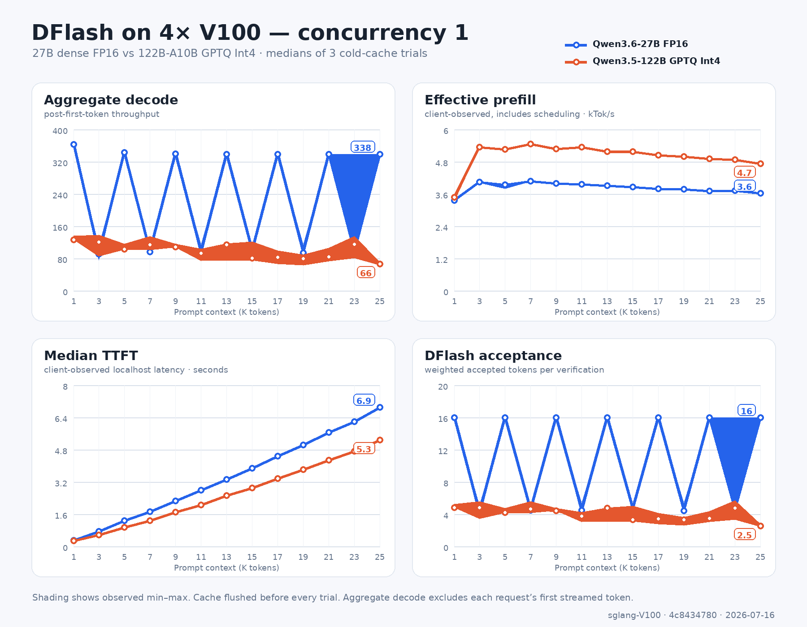
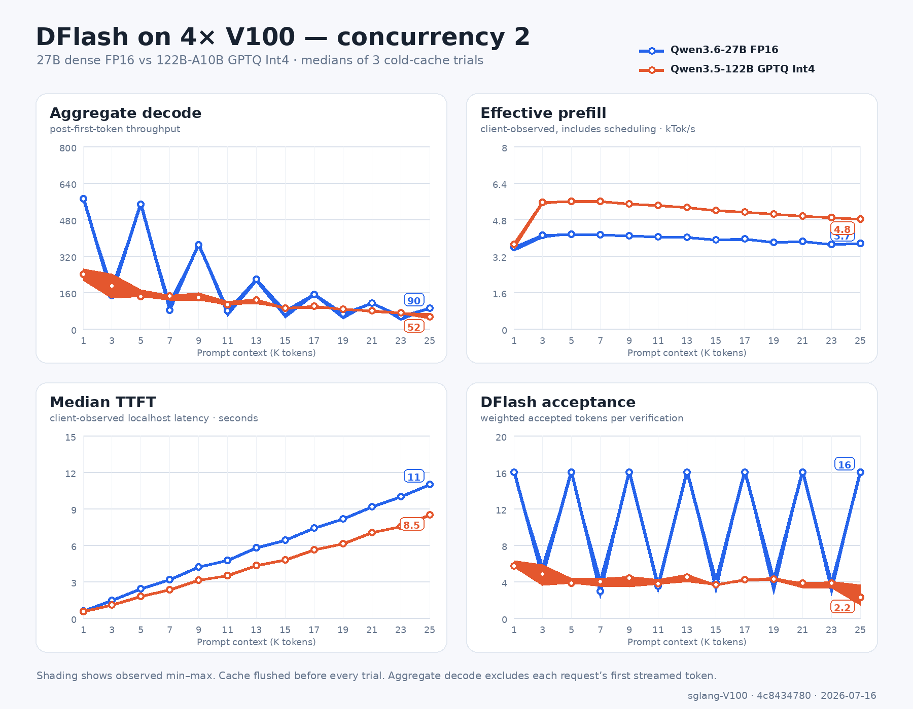
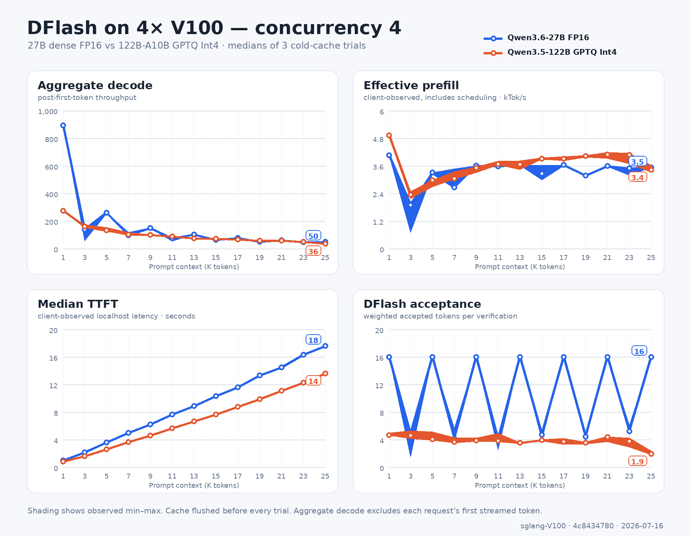

# DFlash on 4× V100: 27B dense and 122B-A10B GPTQ

Test date: 2026-07-16 (Australia/Brisbane)
Repository commit: `4c8434780e92bf0de20c2e4992ce87b3d113eba6`

## Bottom line

- Long-context concurrency is still the limiting case. Qwen3.6-27B at concurrency 4 fell from **894.4 aggregate decode tok/s at 1K** to **49.8 tok/s at 25K** (5.6% of the 1K rate). Both cells reported a perfect 16-token weighted acceptance length, so that drop cannot be blamed on draft quality.
- Qwen3.6-27B at concurrency 1 was much flatter in the same two perfect-acceptance cells: **363.3 tok/s at 1K** and **338.0 tok/s at 25K** (93.0% retained). The severe decay is therefore strongly tied to the context-length × concurrency interaction.
- Qwen3.5-122B-A10B GPTQ at concurrency 4 fell from **275.0 tok/s at 1K** to **35.7 tok/s at 25K** (13.0% retained). Its acceptance also declined (about 4.61 to 1.92), so both verification cost and draft quality contribute.
- At 25K and concurrency 4, median TTFT was **17.58 s** for 27B and **13.59 s** for 122B. These are client-visible localhost times and include chunked scheduling, not kernel-only prefill measurements.
- This run does **not** establish a DFlash speedup over normal decoding because no non-DFlash baseline was collected. It also does not support a direct V100-versus-5060 Ti claim. It answers the narrower question: what the current V100 DFlash stack delivers across 1K–25K context and concurrency 1/2/4 on a realistic mixed coding-agent workload.

## Plots

Each figure overlays both models. Lines are three-run medians and shading is the observed min–max.

### Concurrency 1

### Concurrency 2

### Concurrency 4

## Reddit-size result table

Values are medians of three cold-cache trials. Decode brackets are the observed min–max across those trials. `K` means 1,000 tokenizer tokens.

| Model | Context | Concurrent | TTFT (s) | Effective prefill (tok/s) | Aggregate decode (tok/s), median [range] | Per-request decode (tok/s) | Accept length |
|---|---:|---:|---:|---:|---:|---:|---:|
| Qwen3.6-27B FP16 | 1K | 1 | 0.30 | 3,353 | 363.3 [362.7–363.4] | 363.3 | 16.00 |
| Qwen3.6-27B FP16 | 1K | 2 | 0.55 | 3,565 | 570.4 [568.1–571.6] | 288.0 | 16.00 |
| Qwen3.6-27B FP16 | 1K | 4 | 0.98 | 4,059 | 894.4 [894.0–894.5] | 227.5 | 16.00 |
| Qwen3.6-27B FP16 | 13K | 1 | 3.33 | 3,904 | 338.4 [336.0–338.7] | 338.4 | 16.00 |
| Qwen3.6-27B FP16 | 13K | 2 | 5.76 | 4,012 | 215.9 [204.4–216.5] | 190.7 | 16.00 |
| Qwen3.6-27B FP16 | 13K | 4 | 8.83 | 3,645 | 102.2 [100.6–102.4] | 150.0 | 16.00 |
| Qwen3.6-27B FP16 | 25K | 1 | 6.91 | 3,618 | 338.0 [338.0–338.6] | 338.0 | 16.00 |
| Qwen3.6-27B FP16 | 25K | 2 | 11.00 | 3,744 | 89.9 [87.6–90.0] | 155.0 | 16.00 |
| Qwen3.6-27B FP16 | 25K | 4 | 17.58 | 3,523 | 49.8 [49.8–49.9] | 116.3 | 16.00 |
| Qwen3.5-122B-A10B GPTQ Int4 | 1K | 1 | 0.29 | 3,478 | 126.2 [125.8–136.0] | 126.2 | 4.83 |
| Qwen3.5-122B-A10B GPTQ Int4 | 1K | 2 | 0.53 | 3,707 | 238.5 [209.5–263.6] | 124.2 | 5.69 |
| Qwen3.5-122B-A10B GPTQ Int4 | 1K | 4 | 0.81 | 4,920 | 275.0 [271.0–276.2] | 82.7 | 4.61 |
| Qwen3.5-122B-A10B GPTQ Int4 | 13K | 1 | 2.51 | 5,175 | 114.3 [75.3–117.0] | 114.3 | 4.74 |
| Qwen3.5-122B-A10B GPTQ Int4 | 13K | 2 | 4.30 | 5,312 | 124.5 [106.9–132.1] | 77.9 | 4.45 |
| Qwen3.5-122B-A10B GPTQ Int4 | 13K | 4 | 6.63 | 3,665 | 73.7 [73.2–75.1] | 32.2 | 3.51 |
| Qwen3.5-122B-A10B GPTQ Int4 | 25K | 1 | 5.29 | 4,727 | 65.7 [63.3–70.1] | 65.7 | 2.53 |
| Qwen3.5-122B-A10B GPTQ Int4 | 25K | 2 | 8.47 | 4,801 | 51.8 [40.4–67.1] | 36.2 | 2.23 |
| Qwen3.5-122B-A10B GPTQ Int4 | 25K | 4 | 13.59 | 3,431 | 35.7 [34.7–39.1] | 17.8 | 1.92 |

## Test protocol

- Hardware: 4× Tesla V100-SXM2-32GB, TP=4 over NVLink; NVIDIA driver 580.159.04; 300 W power limit per GPU.
- Software: PyTorch 2.9.1+cu128, CUDA runtime 12.8; repository commit shown above. The captured SGLang package string was `0.0.0.dev13403+ge16efa89c.d20260713`, while execution used the local checkout through `PYTHONPATH`.
- Models: `Qwen/Qwen3.6-27B` FP16 with `z-lab/Qwen3.6-27B-DFlash`; and `Qwen/Qwen3.5-122B-A10B-GPTQ-Int4` with the V100 GPTQ-Marlin target path plus unquantized FP16 `z-lab/Qwen3.5-122B-A10B-DFlash` draft.
- Exact input lengths: 1,000, 3,000, ..., 25,000 tokens, including chat-template overhead. Concurrency: 1, 2, and 4. Each request generated exactly 256 tokens greedily (`temperature=0`, `ignore_eos=true`). Tasks explicitly requested at least 350 words so 256 tokens normally remain inside the answer rather than padding a short response.
- Prompts: unique chat-formatted slices from 423,373 tokens of real repository source, with a unique nonce, source offset, and coding-review task. There is no within-batch shared prefix. Each model uses its own tokenizer and deterministic model-specific slices, so the two model workloads have the same construction/distribution but are not byte-identical prompts.
- Cache policy: `/flush_cache` before every trial plus a short settling delay. Captured response metadata reported zero cached prompt tokens in every request.
- Warmup: unmeasured 1K×4 and 25K×4 boundary trials after server startup. Target and draft CUDA graphs were captured for batch sizes 1, 2, and 4. A one-time 122B first-request JIT event (12.3 s TTFT) was measured separately and excluded; the immediate repeat was 0.84 s at 1K×4.
- Repetitions: three measured passes per cell, 39 cells/model and 117 trials/model. Cell order was deterministically shuffled within each pass so longer contexts were not always tested later.
- Integrity: 27B had 117 trials, 273 requests, 3,549,000 input tokens, and 69,888 output tokens. 122B had 117 trials, 273 requests, 3,549,000 input tokens, and 69,888 output tokens. Across both: zero failed requests, zero wrong output lengths, zero cached prompt tokens, and every first stream chunk contained exactly one token.

## Metric definitions

- **TTFT median / batch max:** within each concurrent trial, the median request TTFT and slowest request TTFT; the table reports the median of each statistic across three trials. It includes localhost HTTP/SSE overhead and server scheduling.
- **Effective prefill:** total input tokens divided by the time from the earliest request start until the last request receives its first streamed token. This deliberately exposes scheduling and straggler effects; it is not a kernel-only prefill throughput.
- **Aggregate decode:** all tokens after each request's first stream chunk divided by the window from the earliest first chunk to the last completion. The first chunk is excluded in full to avoid inflating DFlash throughput if streaming ever batches accepted tokens.
- **Median request decode:** median of each request's post-first-chunk tokens divided by its own post-first-chunk time.
- **E2E output:** all output tokens divided by full batch wall time, including prefill/TTFT.
- **DFlash accept length:** total completion tokens divided by total speculative verification steps, weighted across the concurrent requests.

## Full results: Qwen3.6-27B FP16

### Concurrency 1

| Context | TTFT median / batch max (s) | Effective prefill (tok/s) | Aggregate decode (tok/s), median [range] | Median request decode (tok/s) | E2E output (tok/s) | DFlash accept length |
|---:|---:|---:|---:|---:|---:|---:|
| 1K | 0.30 / 0.30 | 3,353 | 363.3 [362.7–363.4] | 363.3 | 255.9 | 16.00 |
| 3K | 0.74 / 0.74 | 4,040 | 91.1 [76.2–109.0] | 91.1 | 72.2 | 4.20 |
| 5K | 1.27 / 1.27 | 3,942 | 342.9 [341.6–343.3] | 342.9 | 127.3 | 16.00 |
| 7K | 1.72 / 1.72 | 4,068 | 96.1 [88.3–99.5] | 96.1 | 58.5 | 4.49 |
| 9K | 2.26 / 2.26 | 3,985 | 339.5 [339.2–339.5] | 339.5 | 85.1 | 16.00 |
| 11K | 2.78 / 2.78 | 3,958 | 95.3 [82.4–113.2] | 95.3 | 46.9 | 4.49 |
| 13K | 3.33 / 3.33 | 3,904 | 338.4 [336.0–338.7] | 338.4 | 62.7 | 16.00 |
| 15K | 3.88 / 3.88 | 3,862 | 98.8 [90.6–100.7] | 98.8 | 39.6 | 4.65 |
| 17K | 4.47 / 4.47 | 3,799 | 338.3 [338.1–338.8] | 338.3 | 49.0 | 16.00 |
| 19K | 5.04 / 5.04 | 3,767 | 93.7 [92.1–113.2] | 93.7 | 32.9 | 4.41 |
| 21K | 5.66 / 5.66 | 3,713 | 338.1 [337.0–338.5] | 338.1 | 39.9 | 16.00 |
| 23K | 6.18 / 6.18 | 3,720 | 97.0 [86.2–338.0] | 97.0 | 29.1 | 4.57 |
| 25K | 6.91 / 6.91 | 3,618 | 338.0 [338.0–338.6] | 338.0 | 33.4 | 16.00 |

### Concurrency 2

| Context | TTFT median / batch max (s) | Effective prefill (tok/s) | Aggregate decode (tok/s), median [range] | Median request decode (tok/s) | E2E output (tok/s) | DFlash accept length |
|---:|---:|---:|---:|---:|---:|---:|
| 1K | 0.55 / 0.56 | 3,565 | 570.4 [568.1–571.6] | 288.0 | 355.9 | 16.00 |
| 3K | 1.45 / 1.46 | 4,103 | 145.2 [141.6–195.0] | 80.3 | 103.5 | 4.45 |
| 5K | 2.40 / 2.41 | 4,146 | 546.2 [544.2–547.2] | 275.2 | 153.5 | 16.00 |
| 7K | 3.15 / 3.40 | 4,117 | 80.3 [66.5–126.6] | 51.3 | 55.3 | 2.91 |
| 9K | 4.18 / 4.41 | 4,081 | 366.9 [363.9–368.3] | 228.6 | 95.9 | 16.00 |
| 11K | 4.71 / 5.46 | 4,028 | 78.5 [51.5–82.3] | 55.4 | 48.9 | 3.46 |
| 13K | 5.76 / 6.48 | 4,012 | 215.9 [204.4–216.5] | 190.7 | 69.1 | 16.00 |
| 15K | 6.38 / 7.67 | 3,908 | 75.9 [45.8–79.8] | 64.9 | 43.3 | 3.94 |
| 17K | 7.41 / 8.63 | 3,936 | 150.1 [144.1–150.6] | 174.3 | 53.5 | 16.00 |
| 19K | 8.14 / 10.00 | 3,797 | 66.5 [40.6–68.2] | 54.3 | 36.6 | 4.10 |
| 21K | 9.15 / 10.93 | 3,842 | 113.3 [113.2–113.3] | 164.7 | 43.1 | 16.00 |
| 23K | 9.98 / 12.45 | 3,692 | 53.7 [35.3–59.5] | 50.8 | 30.1 | 3.56 |
| 25K | 11.00 / 13.35 | 3,744 | 89.9 [87.6–90.0] | 155.0 | 35.8 | 16.00 |

### Concurrency 4

| Context | TTFT median / batch max (s) | Effective prefill (tok/s) | Aggregate decode (tok/s), median [range] | Median request decode (tok/s) | E2E output (tok/s) | DFlash accept length |
|---:|---:|---:|---:|---:|---:|---:|
| 1K | 0.98 / 0.98 | 4,059 | 894.4 [894.0–894.5] | 227.5 | 486.2 | 16.00 |
| 3K | 2.14 / 6.34 | 1,891 | 137.2 [55.4–141.0] | 66.7 | 112.7 | 4.74 |
| 5K | 3.57 / 6.03 | 3,313 | 259.5 [250.4–261.2] | 218.6 | 151.0 | 16.00 |
| 7K | 4.96 / 10.51 | 2,663 | 96.8 [91.4–119.0] | 53.1 | 76.2 | 4.15 |
| 9K | 6.20 / 9.98 | 3,603 | 149.9 [147.2–150.5] | 179.0 | 95.3 | 16.00 |
| 11K | 7.62 / 12.29 | 3,578 | 74.5 [51.7–75.7] | 44.1 | 58.0 | 3.98 |
| 13K | 8.83 / 14.25 | 3,645 | 102.2 [100.6–102.4] | 150.0 | 68.2 | 16.00 |
| 15K | 10.30 / 18.37 | 3,264 | 61.4 [56.0–62.8] | 38.8 | 47.2 | 4.68 |
| 17K | 11.58 / 18.70 | 3,634 | 76.7 [75.7–76.7] | 134.5 | 52.6 | 16.00 |
| 19K | 13.29 / 23.98 | 3,167 | 48.3 [45.4–50.6] | 32.9 | 37.4 | 4.39 |
| 21K | 14.49 / 23.42 | 3,584 | 60.7 [60.2–60.8] | 124.1 | 42.3 | 16.00 |
| 23K | 16.31 / 26.32 | 3,493 | 44.8 [41.9–45.6] | 32.8 | 33.9 | 5.20 |
| 25K | 17.58 / 28.37 | 3,523 | 49.8 [49.8–49.9] | 116.3 | 35.1 | 16.00 |

## Full results: Qwen3.5-122B-A10B GPTQ Int4

### Concurrency 1

| Context | TTFT median / batch max (s) | Effective prefill (tok/s) | Aggregate decode (tok/s), median [range] | Median request decode (tok/s) | E2E output (tok/s) | DFlash accept length |
|---:|---:|---:|---:|---:|---:|---:|
| 1K | 0.29 / 0.29 | 3,478 | 126.2 [125.8–136.0] | 126.2 | 111.0 | 4.83 |
| 3K | 0.56 / 0.56 | 5,340 | 120.7 [85.1–137.9] | 120.7 | 95.7 | 4.83 |
| 5K | 0.95 / 0.95 | 5,257 | 103.1 [102.0–115.7] | 103.1 | 74.8 | 4.20 |
| 7K | 1.28 / 1.28 | 5,457 | 113.4 [101.1–134.7] | 113.4 | 72.5 | 4.65 |
| 9K | 1.71 / 1.71 | 5,276 | 108.3 [107.0–116.4] | 108.3 | 63.1 | 4.41 |
| 11K | 2.06 / 2.06 | 5,346 | 92.9 [73.9–103.8] | 92.9 | 53.3 | 3.76 |
| 13K | 2.51 / 2.51 | 5,175 | 114.3 [75.3–117.0] | 114.3 | 53.9 | 4.74 |
| 15K | 2.90 / 2.90 | 5,171 | 80.0 [75.5–121.5] | 80.0 | 42.1 | 3.28 |
| 17K | 3.37 / 3.37 | 5,042 | 83.3 [66.5–99.7] | 83.3 | 39.9 | 3.41 |
| 19K | 3.81 / 3.81 | 4,984 | 79.5 [62.9–89.9] | 79.5 | 36.5 | 3.28 |
| 21K | 4.28 / 4.28 | 4,904 | 83.8 [73.2–105.8] | 83.8 | 35.0 | 3.46 |
| 23K | 4.73 / 4.73 | 4,867 | 115.0 [80.8–134.7] | 115.0 | 36.9 | 4.74 |
| 25K | 5.29 / 5.29 | 4,727 | 65.7 [63.3–70.1] | 65.7 | 27.9 | 2.53 |

### Concurrency 2

| Context | TTFT median / batch max (s) | Effective prefill (tok/s) | Aggregate decode (tok/s), median [range] | Median request decode (tok/s) | E2E output (tok/s) | DFlash accept length |
|---:|---:|---:|---:|---:|---:|---:|
| 1K | 0.53 / 0.54 | 3,707 | 238.5 [209.5–263.6] | 124.2 | 192.1 | 5.69 |
| 3K | 1.08 / 1.08 | 5,538 | 188.4 [132.6–240.5] | 102.5 | 135.5 | 4.83 |
| 5K | 1.78 / 1.79 | 5,593 | 140.3 [137.8–172.8] | 81.9 | 94.7 | 3.79 |
| 7K | 2.32 / 2.51 | 5,580 | 143.1 [122.7–146.9] | 76.4 | 90.0 | 3.97 |
| 9K | 3.09 / 3.28 | 5,477 | 136.4 [122.5–157.9] | 90.3 | 77.2 | 4.34 |
| 11K | 3.49 / 4.06 | 5,417 | 105.3 [104.4–121.4] | 70.8 | 66.0 | 3.76 |
| 13K | 4.30 / 4.89 | 5,312 | 124.5 [106.9–132.1] | 77.9 | 65.5 | 4.45 |
| 15K | 4.78 / 5.78 | 5,190 | 89.6 [87.3–93.6] | 63.4 | 54.1 | 3.66 |
| 17K | 5.61 / 6.62 | 5,131 | 99.9 [87.9–100.4] | 70.8 | 52.7 | 4.20 |
| 19K | 6.12 / 7.54 | 5,035 | 86.3 [83.3–88.2] | 67.7 | 48.3 | 4.27 |
| 21K | 7.01 / 8.48 | 4,951 | 78.3 [70.6–80.7] | 58.8 | 42.5 | 3.79 |
| 23K | 7.52 / 9.42 | 4,881 | 70.9 [64.0–72.9] | 55.7 | 39.9 | 3.82 |
| 25K | 8.47 / 10.41 | 4,801 | 51.8 [40.4–67.1] | 36.2 | 31.3 | 2.23 |

### Concurrency 4

| Context | TTFT median / batch max (s) | Effective prefill (tok/s) | Aggregate decode (tok/s), median [range] | Median request decode (tok/s) | E2E output (tok/s) | DFlash accept length |
|---:|---:|---:|---:|---:|---:|---:|
| 1K | 0.81 / 0.81 | 4,920 | 275.0 [271.0–276.2] | 82.7 | 227.1 | 4.61 |
| 3K | 1.59 / 5.13 | 2,336 | 159.4 [149.2–174.8] | 69.6 | 134.5 | 4.57 |
| 5K | 2.61 / 6.71 | 2,978 | 131.0 [119.6–155.1] | 58.5 | 103.7 | 4.03 |
| 7K | 3.65 / 9.21 | 3,039 | 100.3 [100.1–116.7] | 50.1 | 83.3 | 3.64 |
| 9K | 4.58 / 10.24 | 3,514 | 97.6 [96.3–100.4] | 49.9 | 76.7 | 3.85 |
| 11K | 5.62 / 11.94 | 3,681 | 86.4 [82.0–94.0] | 46.9 | 69.5 | 3.82 |
| 13K | 6.63 / 14.18 | 3,665 | 73.7 [73.2–75.1] | 32.2 | 58.2 | 3.51 |
| 15K | 7.65 / 15.36 | 3,904 | 69.7 [66.5–71.2] | 47.6 | 55.6 | 3.92 |
| 17K | 8.77 / 17.35 | 3,917 | 64.1 [59.2–69.0] | 33.2 | 50.0 | 3.71 |
| 19K | 9.89 / 18.86 | 4,024 | 56.0 [55.4–56.7] | 33.2 | 44.7 | 3.52 |
| 21K | 11.09 / 20.51 | 4,091 | 57.6 [53.2–58.5] | 26.3 | 44.0 | 4.34 |
| 23K | 12.27 / 22.53 | 4,081 | 49.0 [44.6–52.0] | 40.6 | 38.7 | 3.76 |
| 25K | 13.59 / 29.12 | 3,431 | 35.7 [34.7–39.1] | 17.8 | 29.2 | 1.92 |

## Reproduction notes

The 27B server used `--mem-fraction-static 0.70` and finalized 306,144 target/draft KV slots with four running-request slots. The 122B server required `--mem-fraction-static 0.72` and finalized 130,320 KV slots with four running-request slots. At 0.70, the 122B server automatically reduced capacity to three requests and changed graph capture to `[1, 2, 3]`; that launch was rejected before measurement. Four 25K prompts plus four 256-token completions require 101,024 token slots, so the measured 122B setup had sufficient capacity.

Exact raw records and server configurations are preserved beside this report:

- `27b/trials.jsonl`, `27b/summary.csv`, `27b/summary.json`, `27b/server_info.json`
- `122b/trials.jsonl`, `122b/summary.csv`, `122b/summary.json`, `122b/server_info.json`
- `bench.py` is the exact streaming harness used for both runs.

The summary CSV/JSON files contain median, min, max, 25th percentile, and 75th percentile for every recorded metric. With only three repetitions, min–max is more transparent than implying a statistically strong percentile estimate.
